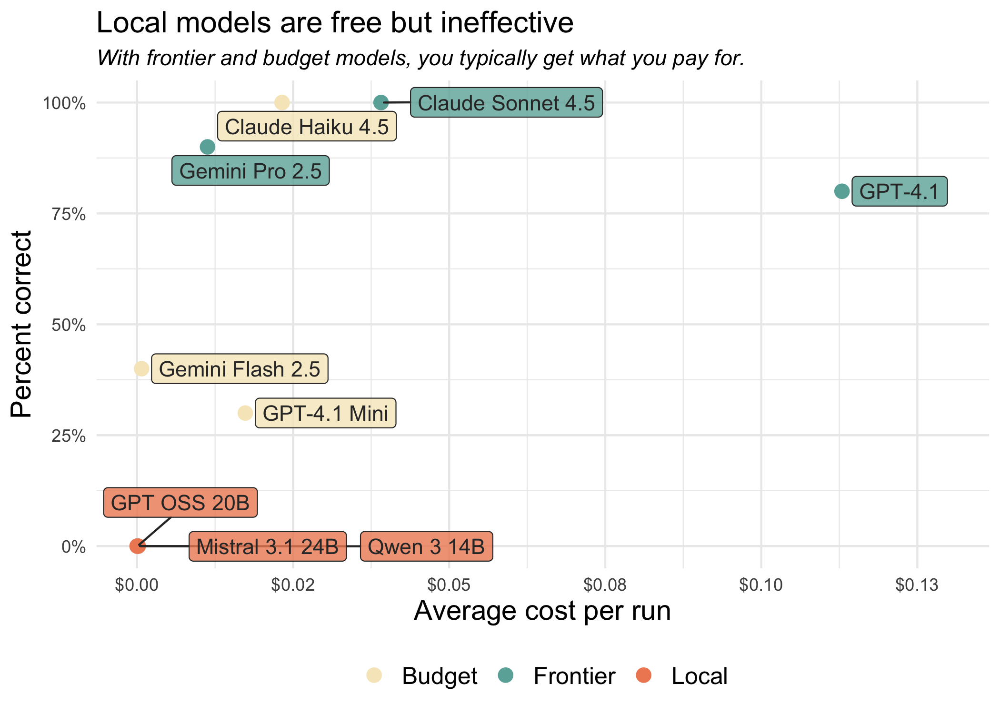

# Local models are not there (yet)
Simon Couch, Sara Altman

One of the most commonly asked questions we get about coding agents like
[Positron Assistant](https://positron.posit.co/assistant),
[Databot](https://positron.posit.co/databot.html), or
[side::kick()](https://simonpcouch.github.io/side/) is whether they can
be used with local models.

The answer is technically yes, but **we don’t recommend it.** You can
connect to local models from Positron Assistant and Databot through an
OpenAI API-compatible endpoint, and you can use `side::kick()` with any
model that connects through `ellmer::chat()`. However, **local models
are not capable enough to be useful in these tools right now.**

We understand why local models are appealing. They address two major
concerns with using LLMs: cost and privacy. Coding agents that use paid,
remote models can easily cost \$100 per week. And if you work with
protected or confidential data, running a model entirely on your laptop
sounds ideal. With a non-local model, you need to [trust your model
provider](https://posit.co/blog/trust-llm-tools/) with your data.

The problem is that the current local models simply aren’t capable
enough yet. In this post, we’ll show results from an evaluation that
tests how well different models can perform a basic code refactoring
task, a fundamental capability for any coding agent.

## How well can agents refactor code?


To assess how well various models work for coding agents, we considered
a **table stakes capability for a coding agent: code refactoring.**
Generally, to refactor code, a coding agent needs to:

1.  Find the file in the project where the original code lives using a
    text search tool.
2.  Read the file that it discovers.
3.  Edit a file to create the helper function.
4.  Edit the original code to use the helper function.

This is a common task that a coding agent should almost always execute
perfectly. If an agent can’t reliably refactor code, it’s not going to
be useful for more complex work.

For this evaluation, Simon created
**[helperbench](https://github.com/simonpcouch/helperbench)**, an
evaluation that tests how well agents can carry out a simple refactor.
To be scored as correct, the agent needs to correctly refactor a bit of
code into a helper function. The evaluation was run ten times for each
model.

**Local models were unsuccessful across the board. The score for each
local model is 0%, meaning that they never successfully refactored the
code.** The frontier models and the budget model Claude Haiku 4.5,
however, were reliably able to refactor the code.[^1] Two Anthropic
models, Claude Sonnet 4.5 and Claude Haiku 4.5, had perfect scores,
successfully refactoring the code ten out of ten times.

> [!NOTE]
>
> ### What about other local models?
>
> We only tested models that met two criteria: (a) could run on a laptop
> at a reasonable speed, and (b) worked with OpenRouter. We used
> OpenRouter to test all models to ensure a level playing field.
>
> Local models not included:
>
> - **Qwen 3 Coder 30B** performed surprisingly well (70% success rate)
>   but is too large to run on an M4 MacBook Pro with 48GB memory unless
>   aggressively quantized, which ruins performance. While it
>   technically worked, it doesn’t meet our first criterion of running
>   on a laptop.
> - **Gemma 3 27B** wasn’t tested because OpenRouter doesn’t support
>   tool calling with that model.
>
> For more details on model choice, see Simon’s
> [post](https://www.simonpcouch.com/blog/2025-12-04-local-agents/) on
> his personal blog, which goes into more detail.

## How local models fail

The **local models never successfully refactored the code**, while the
frontier and budget models ranged from moderately to highly successful.

This is just one evaluation, but code refactoring is a core skill of
coding agents, and this was a relatively simple task. We would need
local models to successfully refactor at least some of the time before
trusting them in a coding agent like Positron Assistant or Databot.

Each local model has its own way it tends to fail:

- [Mistral 3.1
  24B](https://openrouter.ai/mistralai/mistral-small-3.1-24b-instruct:free)
  correctly writes out the steps to make the refactor, but then doesn’t
  actually call the tools needed to carry out those steps.
- [GPT OSS 20B](https://platform.openai.com/docs/models/gpt-oss-20b)
  attempts to call a few tools and struggles to get the argument formats
  right before giving up.
- [Qwen 3 14B](https://openrouter.ai/qwen/qwen3-14b) tends to declare
  success too early, writing the helper function correctly but not
  incorporating it back into the original function.

## Cost vs. performance

Within each category (frontier, budget, and local), there are
substantial differences in the average cost per refactor. It costs
Claude Sonnet 4.5 around four cents to carry out all the steps needed to
refactor the code, while it costs GPT-4.1 around eleven cents.



Note that this is the price *per refactor* task, not per token.
Different models use different numbers of tokens for the same task. Some
models “think” for a while before acting, using up more tokens than
those that don’t, while others struggle to use the tools correctly,
using up tokens in their attempts to resolve tool errors.

## Inspect the logs

You can explore the logs from each of these runs in more detail in the
log viewer below. The logs show the full conversation between the agent
and the tools, including all tool calls, errors, and the agent’s
reasoning process. This lets you see exactly where and how each model
succeeded or failed.

<iframe src="/assets/2025-12-04-local-agents/logs/index.html#/logs" width="100%" height="600px" style="border-radius: 10px; box-shadow: 0 5px 10px rgba(0, 0, 0, 0.3);"></iframe>

## Evaluation details

[helperbench](https://github.com/simonpcouch/helperbench) was
implemented with the [vitals](https://vitals.tidyverse.org/) package.
You can install helperbench to run the evals yourself with
`pak::pak("simonpcouch/helperbench")`.

The evaluation gives models the following function:

> ``` r
> fetch_skill_impl <- function(skill_name, `_intent` = NULL) {
>   skill_path <- find_skill(skill_name)
>
>   if (is.null(skill_path)) {
>     available <- list_available_skills()
>     skill_names <- vapply(available, function(x) x$name, character(1))
>     cli::cli_abort(
>       c(
>         "Skill {.val {skill_name}} not found.",
>         "i" = "Available skills: {.val {skill_names}}"
>       ),
>       call = rlang::caller_env()
>     )
>   }
>
>   skill_content <- readLines(skill_path, warn = FALSE)
>
>   # Remove YAML frontmatter if present
>   content_start <- 1
>   if (length(skill_content) > 0 && skill_content[1] == "---") {
>     yaml_end <- which(skill_content == "---")
>     if (length(yaml_end) >= 2) {
>       content_start <- yaml_end[2] + 1
>     }
>   }
>
>   skill_text <- paste(
>     skill_content[content_start:length(skill_content)],
>     collapse = "\n"
>   )
>   
>   # ...
> ```

And then asks them to refactor part of the code into a helper. Here’s
the exact prompt:

> Refactor this code from my project into a helper:
>
> ``` r
> # Remove YAML frontmatter if present
> content_start <- 1
> if (length(skill_content) > 0 && skill_content[1] == "---") {
>   yaml_end <- which(skill_content == "---")
>   if (length(yaml_end) >= 2) {
>     content_start <- yaml_end[2] + 1
>   }
> }
> ```

The agent is allowed to work until it thinks the task is complete,
meaning it can make failed tool calls and then attempt to correct them.
When the agent finishes, the results are scored as follows:

- The eval checks whether the agent actually made any edits to (at
  least) the relevant file. If it didn’t, that run is a failure.
- Then, unit tests are run on the code written by the agent. If the unit
  tests pass, the run is a pass, otherwise it’s a failure.

You can see more details about the evaluation implementation
[here](https://www.simonpcouch.com/blog/2025-12-04-local-agents/).

## Conclusion

Local models are compelling. They’re free to run and can keep your data
entirely private. However, they just aren’t as capable as the current
best paid models.

The good news is that the field is advancing rapidly. Local models may
at some point catch up to or surpass today’s frontier models. Until
then, if you want to effectively use coding agents, we recommend using
the most capable model you can, which today is probably going to be
Claude Sonnet 4.5, Claude Opus 4.5, or OpenAI GPT-5.

If data privacy is a concern, know that the major model providers can
provide zero data retention agreements and other arrangements, allowing
you to use their LLMs even if you work with confidential or protected
data. To learn more, check out this recent blog post on [trust, privacy,
and LLMs](https://posit.co/blog/trust-llm-tools/).

[^1]: *Frontier* models include models from the major AI labs that we
    would use for a daily driver coding assistant. The *budget* models
    are a step down from the frontier models, typically less reliable
    but also cheaper. The *local* models are models that you can run on
    a laptop.
